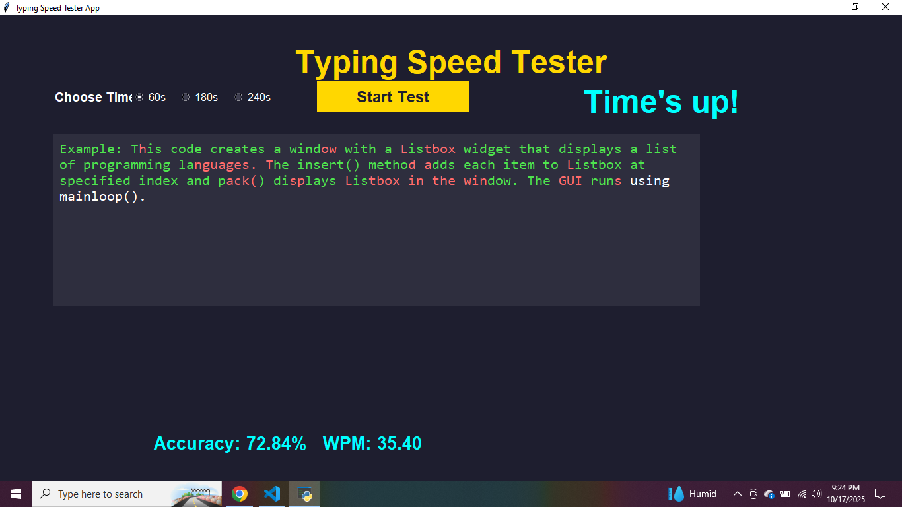

# Speed Typing Tester App

A Python Tkinter application to test your typing speed and accuracy. Users can choose a custom time limit and see their performance in real-time.  

## Features
- Displays a random text to type.
- Tracks typing **accuracy** and **words per minute (WPM)**.
- Allows **custom time selection** for tests.
- Clean and intuitive interface.

## Screenshots

### Home Screen
  
The home screen where you can start the typing test.

### Typing & Timer Screen
  
The main screen shows the text to type and a countdown timer.

### Result Screen
  
Displays your typing **accuracy** and **WPM** after the test ends.

## How to Run
1. Clone this repository:  
   ```bash
   git clone https://github.com/yourusername/speed-typing-tester.git
